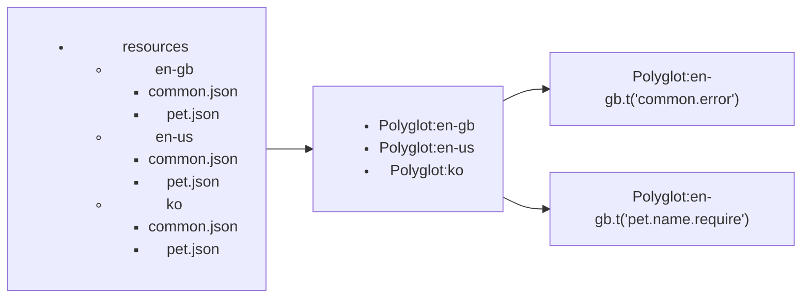

# i18n controller


[](https://npmcharts.com/compare/@maeum/i18n-controller)
[](https://github.com/maeumjs/i18n-controller)
[](https://github.com/maeumjs/i18n-controller/issues)
[](https://www.npmjs.com/package/@maeum/i18n-controller)
[](https://github.com/maeumjs/i18n-controller/actions/workflows/ci.yml)
[](https://github.com/maeumjs/i18n-controller/blob/master/LICENSE)
[](https://codecov.io/gh/imjuni/i18n-controller)
[](https://github.com/prettier/prettier)

The `@maeum/i18n-controller` is a package that helps developer to integreate [node-polyglot](https://airbnb.io/polyglot.js/). Developer can generate a i18n resource via json format file and then use as a singletone class in application(eg. fastify.js or express.js).

Why use `@maeum/i18n-controller`?

- Support i18n feature in your application with less work
- Front-end messages can be managed on server
  - For example, server redeployment allows message changes without front-end or iOS, Android app deployment
- Manage messages as resource file to separate them from source code
  - Separated resource file it can be used in non-HTTP request/response code as well

## Table of Contents <!-- omit in toc -->

- [Getting Started](#getting-started)
  - [installation](#installation)
  - [Configuration](#configuration)
- [How to work?](#how-to-work)
- [Usage](#usage)
- [Option overview](#option-overview)
- [License](#license)

## Getting Started

### installation

```bash
npm install @maeum/i18n-controller --save
```

### Configuration

```ts
// `localeRoot` is resource location
// `defaultLanguage` is fallback language
await I18nContainer.bootstrap({ localeRoot: './resource', defaultLanguge: 'en' }, true);

if (somethingError) {
  throw new Error(I18nContainer.it.t('en', 'common.error', { id: 'your pet id' }));
}
```

## How to work?

The `@maeum/i18n-controller` implements i18n support using [node-polyglot](https://airbnb.io/polyglot.js/). You can use directories to create polyglot objects in multiple languages, and polyglot objects to manage and consume i18n messages.



Each resource files, like `common.json`, use [jsonc-parser](https://www.npmjs.com/package/jsonc-parser) to read in content, so you can add comments to the resource file.

```jsonc
{
  // korean common error message
  // you can add comments in resource file
  "error": "An error occurred, please try again later"
}
```

## Usage

```ts
// synchronous bootstrap
I18nContainer.bootstrap({ localeRoot: './resources' }, false);

// asynchronous bootstrap
await I18nContainer.bootstrap({ localeRoot: './resources' }, true);

// custom polyglot function
// @see https://github.com/airbnb/polyglot.js#options-overview
await I18nContainer.bootstrap({ localeRoot: './resources', polyglot: { ...your custom option } }, true);

// translate function
I18nContainer.it.t('common.error', { id: 'petId' });
```

## Option overview

Detail option can check [here](https://github.com/maeumjs/i18n-controller/blob/master/src/interfaces/I18nContainerOption.ts).

| name                   | type     | required | description                                                                                                                                                                                                                                                                                                  |
| ---------------------- | -------- | -------- | ------------------------------------------------------------------------------------------------------------------------------------------------------------------------------------------------------------------------------------------------------------------------------------------------------------ |
| localeRoot             | string   | required | Specify the location of the resource file                                                                                                                                                                                                                                                                    |
| defaultLanguage        | string   |          | Specify the default language. If no language is found when using t function (translate function), the default language translation function is used                                                                                                                                                          |
| polyglot.allowMissing  | boolean  |          | a boolean to control whether missing keys in a t call are allowed. If false, by default, a missing key is returned and a warning is issued                                                                                                                                                                   |
| polyglot.interpolation | object   |          | an object to change the substitution syntax for interpolation by setting the prefix and suffix fields                                                                                                                                                                                                        |
| polyglot.onMissingKey  | function |          | if allowMissing is true, and this option is a function, then it will be called instead of the default functionality. Arguments passed to it are key, options, and locale. The return of this function will be used as a translation fallback when polyglot.t('missing.key') is called (hint: return the key) |
| pluralRules            | object   |          | an object of pluralTypes and pluralTypeToLanguages to control pluralization logic                                                                                                                                                                                                                            |

## License

This software is licensed under the [MIT](https://github.com/maeumjs/i18n-controller/blob/master/LICENSE).
